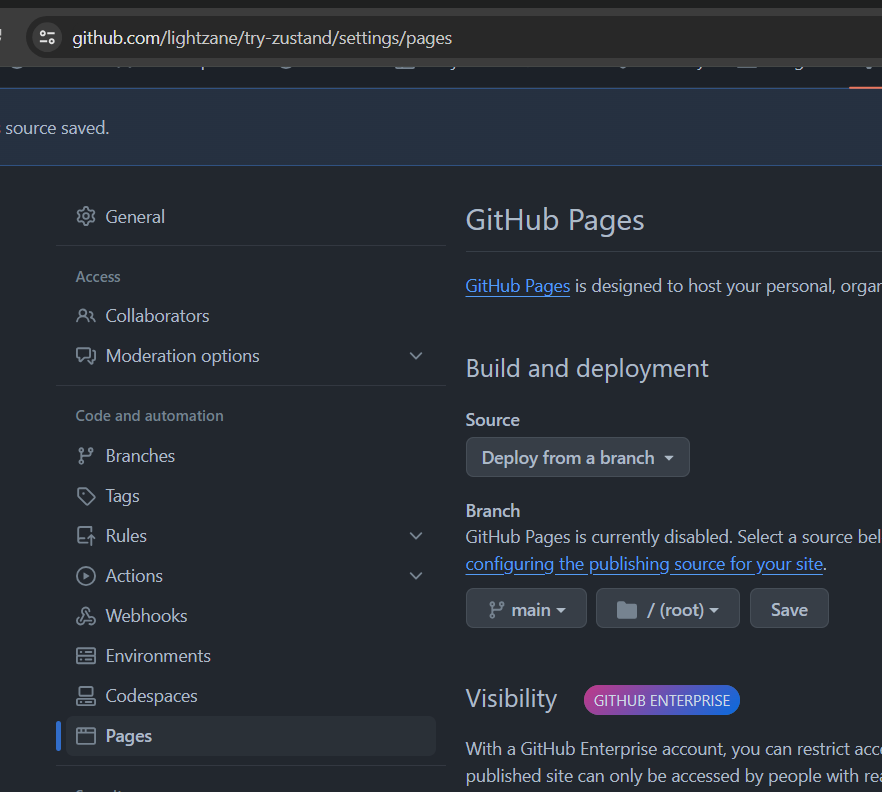
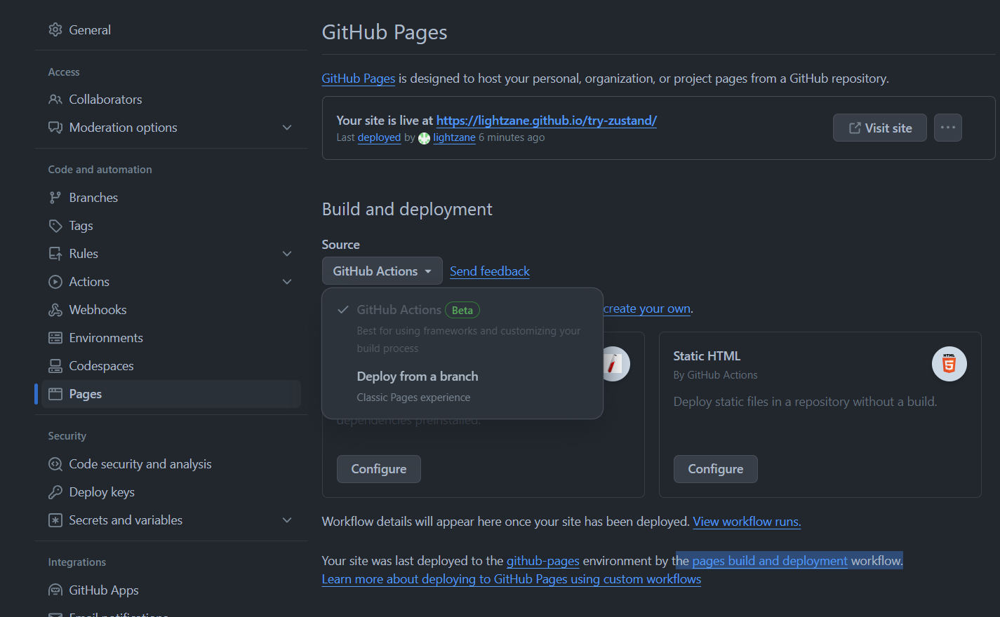

# Try Zustand and more...

Trying out [Zustand][zustand] as state management.

[zustand]: https://docs.pmnd.rs/zustand/getting-started/introduction

**WITH BONUS**:

- **CSS** Guide on [**Sticky Aside**](#sticky-aside)
- [**Form validation**](#form-validation) using `zod`, `react-hook-form` and `@hookform/resolvers`
- [**Vite Deployment**](#vite-deployment-using-github-actions) on GitHub Pages using **GitHub Actions**

## Getting Started

```bash
npm install zustand
```

## Content

### Examples

- [Typescript](#typescript)
- [Javascript](#javascript)
- [Usage](#examples)

### Actual Examples used in this Project

- [Example 1](#example-1)
  - [Usage 1](#usage-1)
- [Example 2](#example-2)
  - [Usage 2](#usage-2)

### Typescript

```ts
import { create } from 'zustand';

interface BearState {
  bears: number;
  increase: (by: number) => void;
}

const useBearStore = create<BearState>()((set) => ({
  bears: 0,
  increase: (by) => set((state) => ({ bears: state.bears + by })),
}));
```

> Note the currying `()(...)` is not a typo!

https://docs.pmnd.rs/zustand/guides/typescript

### Javascript

```js
import { create } from 'zustand';

const useStore = create((set) => ({
  bears: 0,
  increasePopulation: () => set((state) => ({ bears: state.bears + 1 })),
  removeAllBears: () => set({ bears: 0 }),
  updateBears: (newBears) => set({ bears: newBears }),
}));
```

https://docs.pmnd.rs/zustand/getting-started/introduction#first-create-a-store

#### Usage

```js
function BearCounter() {
  const bears = useStore((state) => state.bears);
  return <h1>{bears} around here...</h1>;
}

function Controls() {
  const increasePopulation = useStore((state) => state.increasePopulation);
  return <button onClick={increasePopulation}>one up</button>;
}
```

## Actual Example in this Project

### Example 1

[`src/stores/tab.ts`](./src/stores/tab.ts)

```ts
import { create } from 'zustand';

type Tabs = 'todo' | 'done';

type TabState = {
  active: Tabs;
  setActive: (active: Tabs) => void;
};

export const useTabStore = create<TabState>()((set) => ({
  active: 'todo', // initial
  setActive: (active) => set(() => ({ active })),
}));
```

### Usage 1

See [`src/components/tabs.tsx`](./src/components/tabs.tsx)

### Example 2

See [`src/stores/todo.ts`](./src/stores/todo.ts)

### Usage 2

See following:

- [`src/components/done-list.tsx`](./src/components/done-list.tsx)
- [`src/components/todo-list.tsx`](./src/components/todo-list.tsx)
- [`src/components/header.tsx`](./src/components/header.tsx)

and more...

## Sticky Aside

3 building blocks (**HTML DOM**) for this structure:

- Parent
- Aside (child)
- Main content (child)

<!-- prettier-ignore -->
```tsx
{/* 
    Parent style:
      display: flex
      flex-direction: row // ! DO NOT implement on small devices
*/}
<div className='flex flex-col md:flex-row ... gap-5'>
  {/* 
      Aside style:
        position: sticky
        top: ?? // * adjust accordingly
        align-self: flex-start // ! important for "sticky" to work
  */}
  <aside className='sticky top-24 self-start ... w-full md:max-w-xs p-5 ring-2 ring-teal-500 rounded-lg bg-slate-200'>
    ...
  </aside>
  {/* 
      Content style: any
  */}
  <main className='flex-1 p-5 ring-2 ring-teal-500 rounded-lg h-[5000px]'>
    ...
  </main>
</div>
```

## Form Validation

[z]: https://zod.dev/
[h]: https://react-hook-form.com/
[r]: https://github.com/react-hook-form/resolvers?tab=readme-ov-file#install

```bash
npm i zod react-hook-form @hookform/resolvers
```

| package                  | description                                                                                                                                                                                                           |
| ------------------------ | --------------------------------------------------------------------------------------------------------------------------------------------------------------------------------------------------------------------- |
| [`zod`][z]               | TypeScript-first schema validation with static type inference.                                                                                                                                                        |
| [`react-hook-form`][h]   | Performant, flexible and extensible forms with easy-to-use validation.                                                                                                                                                |
| [@hookform/resolvers][r] | <ul><li>Used to bridge the gap between `zod` and `react-hook-form`</li><li>Validation resolvers: Yup, `Zod`, AJV, Joi, Superstruct, Vest, class-validator, io-ts, typanion, Ajv, TypeBox, Valibot and nope.</li></ul> |

### `zod`

[`src/components/add-todo-form.tsx`](./src/components/add-todo-form.tsx)

```ts
import { z } from 'zod';

const AddSchema = z.object({
  value: z.string().min(1, 'This field is required'),
});

type AddData = z.infer<typeof AddSchema>;
```

#### Standalone Usage of zod

```ts
const result = AddSchema.safeParse({ value: '' });

if (!result.success) {
  console.log(result.error.issues);
}
```

### `react-hook-form` and `@hookform/resolvers`

Inside a react component...[`add-todo-form.tsx`](./src/components/add-todo-form.tsx)

```tsx
import { useForm } from 'react-hook-form';
import { zodResolver } from '@hookform/resolvers/zod';

// ... zod codes here

export default () => {
  const {
    register,
    handleSubmit,
    reset,
    formState: { errors, isValid },
  } = useForm<AddData>({
    resolver: zodResolver(AddSchema),
    mode: 'onChange', // default is 'onSubmit'
  });

  const onValid = (data: AddData) => {
    console.log(data, 'success validation')
  }

  return (
    <form
      onSubmit={handleSubmit(
        onValid,
        /*, insert callback for invalid data as 2nd argument */,
      )}>

      <input {...register('value')} type='text' />
      Errors: {errors.value?.message}
    </form>
  )
}
```

## Vite Deployment using Github Actions

Reference: https://vitejs.dev/guide/static-deploy.html

### Testing App Locally

```bash
npm run build
npm run preview
```

### Vite Configuration

Set the correct `base` in [`vite.config.ts`](./vite.config.ts)

```ts
import { defineConfig } from 'vite';
import react from '@vitejs/plugin-react';

// https://vitejs.dev/config/
export default defineConfig({
  plugins: [react()],
  base: '',
  server: {
    port: 4200,
  },
});
```

#### Enable GitHub Pages



1. Go to repository `Settings`
2. Under **code and automation**, select `Pages`
3. Under **Build and deployment**, and **Branch**, select `main` branch with `/root` folder.
4. Click `save`
5. Setup [`ci.yaml`](#github-workflow-yaml) once, then push your changes anytime!

**NOTE**, doing the steps `1-4` above will use the Github's default workflow `pages build and deployment`
so you have to manually run the your `Vite Deployment of static content to Pages` workflow ([see below](#github-workflow-yaml)).

#### Otherwise, use the `GitHub Actions` as the source under **Build and Deployment**.



### Github Workflow Yaml

See [`ci.yaml`](./.github/workflows/ci.yml)

```yaml
# Simple workflow for deploying static content to GitHub Pages
name: Vite Deployment of static content to Pages

on:
  # Runs on pushes targeting the default branch
  push:
    branches: ['main']

  # Allows you to run this workflow manually from the Actions tab
  workflow_dispatch:

# Sets the GITHUB_TOKEN permissions to allow deployment to GitHub Pages
permissions:
  contents: read
  pages: write
  id-token: write

# Allow one concurrent deployment
concurrency:
  group: 'pages'
  cancel-in-progress: true

jobs:
  # Single deploy job since we're just deploying
  deploy:
    environment:
      name: github-pages
      url: ${{ steps.deployment.outputs.page_url }}
    runs-on: ubuntu-latest
    steps:
      - name: Checkout
        uses: actions/checkout@v4
      - name: Set up Node
        uses: actions/setup-node@v4
        with:
          node-version: 20
          cache: 'npm'
      - name: Install dependencies
        run: npm ci
      - name: Build
        run: npm run build
      - name: Setup Pages
        uses: actions/configure-pages@v4
      - name: Upload artifact
        uses: actions/upload-pages-artifact@v3
        with:
          # Upload dist folder
          path: './dist'
      - name: Deploy to GitHub Pages
        id: deployment
        uses: actions/deploy-pages@v4
```
